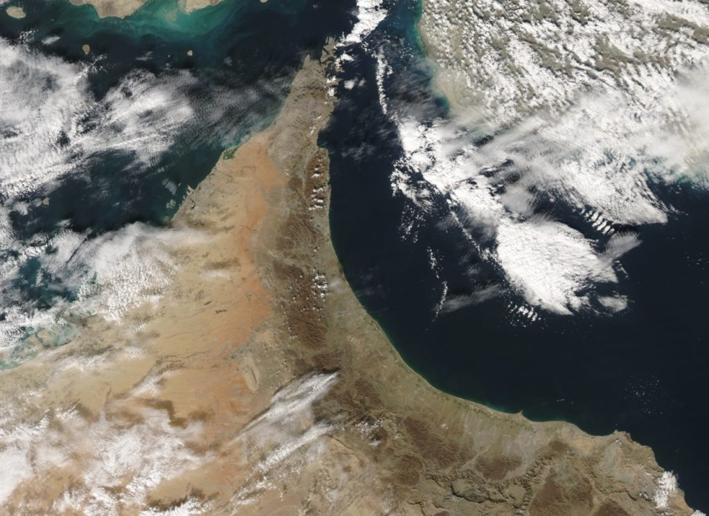
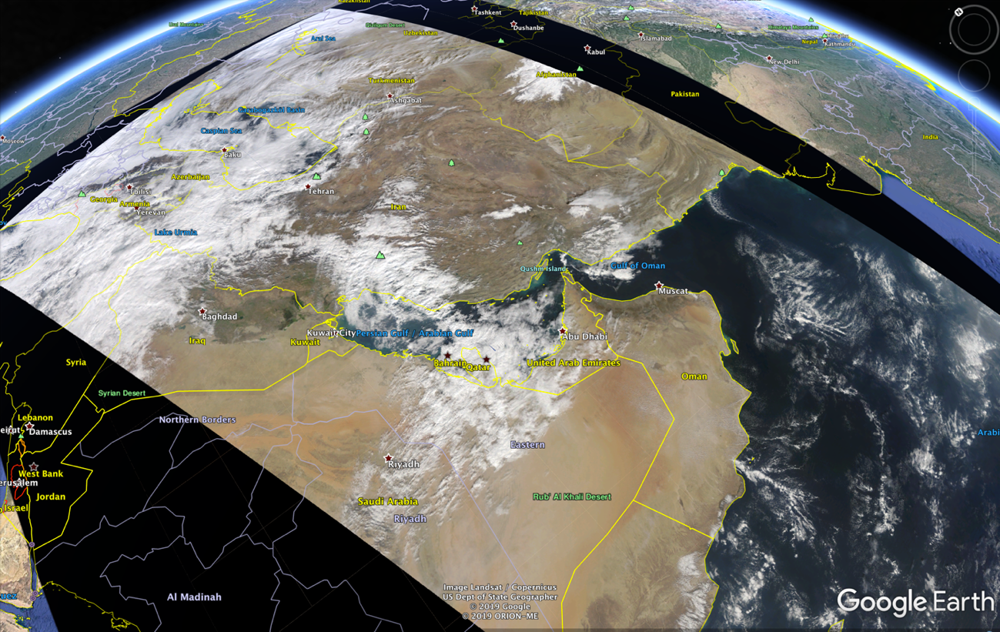

Copyright Amazon.com, Inc. or its affiliates. All Rights Reserved.
PDX-License-Identifier: MIT-0

#	Implementing an Automated Ground Station EOS pipeline

Following this guide results in the implementation of an automated solution that downloads and processes data received from a satellite via the AWS GroundStation service.

This is the technical guide for the [Earth observation using AWS Ground Station blog post](https://aws.amazon.com/blogs/publicsector/earth-observation-using-aws-ground-station/).

# Solution Overview


The solution operates as follows:

1. AWS GroundStation triggers a CloudWatch event during a PREPASS transtion, a few minutes before a satellite contact.
2. The CloudWatch event, triggers a Lambda function which starts up the Receiver EC2 instance.
3. The Receiver EC2 instance captures the raw data from the Ground Station service via RT Logic's Data Defender software.
4. The Data Capture Application running on the Receiver instance, strips out and combines the payload data from the incoming VITA 49 data stream.
5. The Data Capture Application starts up RT-STPS which processes the raw data into Level 0 data.
6. The Data Capture Application pushes the data to S3, sends an SNS notification, then shuts down.
7. The SNS Notification triggers a Lambda function which starts up the Processor EC2 instance.
8. The Processor EC2 Instance pulls the data from S3, then processes it using IPOPP. Takes about 60 minutes.
9. The Processor EC2 Instance pushes the Level 1A, Level 1B and Level 2 data it produces to S3.
10. The Processor EC2 Instance sends an SNS notification, then shuts down.

To summarize, by scheduling a satellite contact in AWS GroundStation, steps 1-10 are automatically completed, which result in the data being made available via the S3 bucket.
If you subscribe to the SNS notifications, you will also receive emails with the output of the processing jobs.

# Earth Observation Science Data Levels

Earth Observation data products are most commonly described using levels 0-4 provided by NASA.
The levels are summarized below. For more information click [here](https://science.nasa.gov/earth-science/earth-science-data/data-processing-levels-for-eosdis-data-products).

- Level 0: Raw data from sensors with communications artifacts removed
- Level 1: Georeferenced and adjusted for known sources of error or interference
- Level 2: Specific data-rich products such as sea surface temperature data, or visible light data
- Level 3: Data mapped onto uniform space-time grid scales
- Level 4: Model output or results from deeper analysis of lower-level data, often using data from multiple measurements

#	Prerequisites
---

##  AWS CLI Configured

[Install the latest AWS CLI](https://docs.aws.amazon.com/cli/latest/userguide/cli-chap-getting-started.html) and [configure it](https://docs.aws.amazon.com/cli/latest/userguide/cli-configure-quickstart.html#cli-configure-quickstart-config) with an IAM User role with privileges to the AWS Account you want to use.
If in doubt, use admin for testing, but create a Least Privileged Access (LPA) IAM user/role for any other environments.

##  Ground Station setup in your AWS Account

Send an email to aws-groundstation@amazon.com with the following details:
- Satellite NORAD ID: 27424 (AQUA)
- Your AWS Account Id
- AWS Regions you want to use the Ground Station Service
- AWS Regions you want to downlink the data to, normally the same as above

##	A VPC with public subnets, plus an SSH key for accessing EC2 instance(s)

Make sure at minimum you have one SSH key and one VPC with an attached IGW and one public subnet. 
You can use the default VPC provided in the region. Follow [these instructions](https://docs.aws.amazon.com/AWSEC2/latest/UserGuide/ec2-key-pairs.html#having-ec2-create-your-key-pair) to create an EC2 SSH key in the region that you will be deploying your EC2 resources. 

##  Create working directory

Execute these commands on your local machine command line. 

### Linux / Mac

```bash
export WORKING_DIR='/Users/User/Downloads/ipopp-test'
mkdir -p $WORKING_DIR
cd $WORKING_DIR
```

### Windows

```bash
set WORKING_DIR=\Users\User\Downloads\ipopp-test
mkdir %WORKING_DIR%
cd %WORKING_DIR%
```

## Clone this repo
Install Git by following [these instructions](https://github.com/git-guides/install-git).

```bash
git clone https://github.com/awslabs/aws-groundstation-eos-pipeline.git
```

Alternatively, you can download this GitHub repository by clicking Code -> Download ZIP at the top of this page. 

#	Receiver Instance - RT-STPS
---

Follow the steps below to configure AWS GroundStation to process data from the AQUA Satellite and create an EC2 instance to receive the data.
The EC2 instance receives the data, processes it using NASA's RealTime Satellite Telemetry Processing Software (RT-STPS) and uploads the data to S3.
Once the data is uploaded an SNS Notification is sent which triggers the IPOPP Processing node which creates the usable data products.

##	Create S3 bucket

Setup some variables, then create the new S3 bucket.
Create this in the region where your EC2 downlink resources will be. 

Edit the REGION and S3_BUCKET variables below, then execute the code.

Execute these commands on your local machine command line. 

### Linux / Mac

```bash
export REGION=your-aws-region
export S3_BUCKET=your-bucket-name

# Create the new S3 bucket if not already created
aws s3 mb s3://${S3_BUCKET} --region $REGION
```

### Windows

```bash
set REGION=your-aws-region
set S3_BUCKET=your-bucket-name

aws s3 mb s3://%S3_BUCKET% --region %REGION%
```

## Copy the data capture application to the new bucket

The data capture application files (receivedata.py, awsgs.py, start-data-capture.sh) are all found in this repository. 

Execute these commands on your local machine command line. 

### Linux / Mac

```bash
aws s3 cp $WORKING_DIR/aws-groundstation-eos-pipeline/python/receivedata.py s3://${S3_BUCKET}/software/data-receiver/receivedata.py --region $REGION 
aws s3 cp $WORKING_DIR/aws-groundstation-eos-pipeline/python/awsgs.py s3://${S3_BUCKET}/software/data-receiver/awsgs.py --region $REGION 
aws s3 cp $WORKING_DIR/aws-groundstation-eos-pipeline/bash/start-data-capture.sh s3://${S3_BUCKET}/software/data-receiver/start-data-capture.sh --region $REGION 
```

### Windows

```bash
aws s3 cp %WORKING_DIR%\aws-groundstation-eos-pipeline\python\receivedata.py s3://%S3_BUCKET%/software/data-receiver/receivedata.py --region %REGION% 
aws s3 cp %WORKING_DIR%\aws-groundstation-eos-pipeline\python\awsgs.py s3://%S3_BUCKET%/software/data-receiver/awsgs.py --region %REGION% 
aws s3 cp %WORKING_DIR%\aws-groundstation-eos-pipeline\bash\start-data-capture.sh s3://%S3_BUCKET%/software/data-receiver/start-data-capture.sh --region %REGION% 
```

## Create the CloudFormation Stack for the receiver instance

Create a CFN stack using the template: aqua-rt-stps.yml. [Learn how to create a CFN stack](https://docs.aws.amazon.com/AWSCloudFormation/latest/UserGuide/cfn-console-create-stack.html). On the [stack creation console](https://console.aws.amazon.com/cloudformation) click Create Stack -> With New Resource. Then select the "Template is ready" radio button and "Upload a template file" radio button. Upload the aqua-rt-stps.yml file here. Do not edit the aqua-rt-stps.yml file manually!

Here is the link to the .yml file:
https://github.com/awslabs/aws-groundstation-eos-pipeline/tree/main/cfn

Enter parameters as follows in the CloudFormation console:

**Important Note** The IP address or range you enter into the SSHCidrBlock parameter will have access to both SSH on port 22 and the web-based Data Defender software on port 80. Adding large address ranges such as 0.0.0.0/0 will allow any IP address to access the ports and should not be done.

- Stack name: 'any value' e.g. gs-receiver-aqua
- NotificationEmail: 'your-email-address'
- S3Bucket: 'your-s3-bucket'
- SSHCidrBlock: 'your-public-ip'/32
- SSHKeyName: 'your-ssh-key-name'
- SatelliteName: AQUA
- SubnetId: 'a public subnet'
- VpcId: 'the VPC containing the above public subnet'

##  Subscribe to the SNS topic

During the creation of the CloudFormation stack an SNS topic is created.
To receive email messages you must subscribe to the topic by clicking the link sent to the email address specified when creating the stack.

##  Watch the progress

Once the EC2 instance is created the required software is installed and configured.
You can watch this progress by connecting to the instance using [SSH for Linux/Mac users](https://docs.aws.amazon.com/AWSEC2/latest/UserGuide/AccessingInstancesLinux.html) or by using [PuTTY for Windows users](https://docs.aws.amazon.com/AWSEC2/latest/UserGuide/putty.html). The username is "ec2-user". Example command for Linux/Mac to be run on your local machine: 

```bash
ssh -i <path-to-ssh-key-file> ec2-user@<instance-public-ip>
```

After logging in to the EC2 instance you can run this command in the terminal session to check the user-data logfile: 

```bash
tail -F /var/log/user-data.log
```

**Note1:** The Receiver instance automatically shuts down once configuration is completed.

**Note2:** For this solution to work correctly, the EC2 instance must either be shutdown a few minutes before the contact, or you must manually start the data capture application. The easy option: Shutdown/Stop the EC2 instance :).

##  Summary

You now have the following created in your AWS Account:

- A DataDeliveryServiceRole which the Ground Station service will use to create required resources in your AWS account
- The Receiver EC2 instance
- An IAM Role and Instance Profile, attached to the EC2 instance with permission to connect to a specified S3 bucket
- An ENI, attached to the EC2 instance to receive data from the Ground Station Service
- A Ground Station Mission Profile configured for the AQUA Satellite
- A Ground Station Demodulation and Decode configuration for the AQUA Satellite, compatible with the downstream processing software RT-STPS
- An SNS Topic to notify data capture completion
- GroundStation CloudWatch events
- A Lambda function which auto starts the EC2 instance during a PREPASS with a configured contact

#	Processor Instance Creation - IPOPP
---

Follow these steps to create the IPOPP instance which takes the data produced by the receiver node (RT-STPS) to create usable level 2 earth observation data products.
Execute these commands on your local machine command line.

```bash
export REGION=your-aws-region
export S3_BUCKET=your-bucket-name
```

### Windows

```bash
set REGION=your-aws-region
set S3_BUCKET=your-bucket-name
```

##  Copy the IPOPP files to the new bucket
The IPOPP scripts (ipopp-ingest.sh, install-ipopp.sh) are found in this repository. 

Execute these commands on your local machine command line.

### Linux / Mac

```bash
aws s3 cp $WORKING_DIR/aws-groundstation-eos-pipeline/bash/ipopp-ingest.sh s3://${S3_BUCKET}/software/IPOPP/ipopp-ingest.sh --region $REGION 
aws s3 cp $WORKING_DIR/aws-groundstation-eos-pipeline/bash/install-ipopp.sh s3://${S3_BUCKET}/software/IPOPP/install-ipopp.sh --region $REGION 
```

### Windows

```bash
aws s3 cp %WORKING_DIR%\aws-groundstation-eos-pipeline\bash\ipopp-ingest.sh s3://%S3_BUCKET%/software/IPOPP/ipopp-ingest.sh --region %REGION% 
aws s3 cp %WORKING_DIR%\aws-groundstation-eos-pipeline\bash\install-ipopp.sh s3://%S3_BUCKET%/software/IPOPP/install-ipopp.sh --region %REGION% 
```

##  Create the IPOPP Instance CloudFormation Stack

Create a CFN stack using the template: ipopp-instance.yml. Follow the same procedure as for the aqua-rt-stps.yml file. Do not edit the ipopp-instance.yml file manually!

Here is the link to the .yml file:
https://github.com/awslabs/aws-groundstation-eos-pipeline/tree/main/cfn

Enter parameters as follows:

**Important Note** The IP address or range you enter into the SSHCidrBlock parameter will have access to SSH on port 22. Adding large address ranges such as 0.0.0.0/0 will allow any IP address to access the port and should not be done.

- Stack name: 'any value' e.g. gs-processor-aqua
- InstanceType: m5.xlarge is OK for most IPOPP Software Processing Algorithms (SPAs). However, you will need c5.4xlarge to use the Blue Marble MODIS Sharpened Natural/True color SPAs.
- S3Bucket: 'your-bucket-name' (The one you created earlier)
- SSHCidrBlock: 'your-public-ip'/32. If needed get it from https://whatismyip.com. Ensure you add “/32” to the end of the IP address
- SSHKeyName: 'your-ssh-key-name'
- SatelliteName: AQUA
- SubnetId: 'A Public Subnet'
- VpcId: 'Select the VPC containing the above public subnet'
- ReceiverCloudFormationStackName: The name of the CloudFormation Stack that created the receiver instance. e.g. gs-receiver-aqua


##  Subscribe to the SNS topic

During the creation of the CloudFormation stack an SNS topic is created.
To receive email messages you must subscribe to the topic by clicking the link sent to the email address specified when creating the stack.

##  Watch the progress  

The the EC2 instance set up is automatic. It includes the installation of the IPOPP software for image analysis. You can follow the progress of the automatic part over SSH by running the following commands. This takes about 1 hour to complete. 

SSH Connection:
```bash
ssh -i <path-to-ssh-key-file> ubuntu@<instance-public-ip>
```

Check the user-data logfile:
```bash
tail -F /var/log/user-data.log
```

##  Summary

You now have the following created in your AWS Account:

- An EC2 Instance running Ubuntu 20 and the IPOPP software
- An SNS topic to notify processing completion
- A Lambda function to auto-start the IPOPP instance, triggered by the receiver SNS Topic

#	Processor Instance Configuration - IPOPP
---

These last steps in the configuration of the IPOPP processor instance must be completed manually.   


## Prerequisites

Download and install the Tiger VNC Client from [here](https://sourceforge.net/projects/tigervnc/files/stable/1.13.1/).
Or use the following quick-links for [Linux](https://sourceforge.net/projects/tigervnc/files/stable/1.13.1/tigervnc-1.13.1.x86_64.tar.gz/download),
[Mac](https://sourceforge.net/projects/tigervnc/files/stable/1.13.1/TigerVNC-1.13.1.dmg/download)
and [64 bit Windows](https://sourceforge.net/projects/tigervnc/files/stable/1.13.1/vncviewer64-1.13.1.exe/download).

## VNC Setup - Linux / Mac

1.	Run the command below to connect to the EC2 instance from your local machine using SSH and tunnel the VNC traffic over the SSH session.

    ```bash
    ssh -L 5901:localhost:5901 -i <path to pem file> ubuntu@<public ip address of EC2 instance>
    ```

2.	Open the Tiger VNC Client application on your PC and connect to ‘localhost:1’
3.	When prompted, enter the ipopp password you provided to the CloudFormation template in the earlier step


##	VNC Setup - Windows

1.	Download the open source ssh client Putty from [here](https://www.chiark.greenend.org.uk/~sgtatham/putty/latest.html)
2.	Open Putty and enter the public IP of the EC2 instance in the Session->Host Name (or IP Address) field.
3.	Enter 'ubuntu' in Connection->Data-> Auto-login username
4.	In Connection->SSH->Auth, browse to the correct PPK key file (private SSH key) for the EC2 instance
5.	In Connection->SSH->Tunnels, enter 5901 in Source port, enter localhost:5901 in Destination, click Add
6.	Click Session, enter a friendly name in Save Sessions, then click Save
7.	Click Open to open the tunneled SSH session
8.	Open the Tiger VNC Client application on your PC and connect to ‘localhost:1’
9.	When prompted, enter the ipopp password you provided to the CloudFormation template in the earlier step

**Note1:** Typically EC2 instances within your AWS account use ".pem" SSH key format, but PuTTy requires ".ppk" format for the SSH key.
Please download and install PuTTygen [here](https://www.puttygen.com/), and convert the ".pem" SSH key into a ".ppk" SSH key.

**Note2:** If the Tiger VNC client cannot connect, or you see only a blank screen you may need to restart the vncserver process on the instance. To do this run the commands below in the SSH session to start the vnc server as the ipopp user:

```bash
su -l ipopp
sudo systemctl stop vncserver.service
sudo systemctl start vncserver.service
```

##  IPOPP SPA Configuration

By default, IPOPP creates data products which are Level 1A and Level 1B only.
These data products are great to use for further processing using software such as polar2grid, but if we want IPOPP to create usable Level 2 products we must enable additional IPOPP Software Processing Algorithms (SPAs).
Unfortunately, SPAs can only be configured using a GUI java application.
Follow the steps below to connect to the server using a VPC client, then configure the required SPAs.

Perform the following steps within the VNC session on the IPOPP EC2 instance.  

1. Open a terminal and run the ipopp dashboard:

    ```bash
    ~/drl/tools/dashboard.sh &
    ```

2.	In the dashboard, click Mode->IPOPP Configuration Editor
3.	Click Actions->Configure Projection, Select Stereographic, then click Configure Projection
4.	On the EOS tab enable other SPA modules as desired by simply clicking on them. You may want to enable all of SPAs in your initial experimentation to see the data created by each SPA.
5.	Once you have finished enabling SPAs, click Actions->Save IPOPP Configuration
6.	To start the SPA services and see the progress visually, click Mode->IPOPP Process Monitor, click 'Yes' to save, then click Actions->Start SPA Services, click 'Yes' to confirm. This will start-up the required services. Each service when started will check for the input data it requires and process it. The processed data for AQUA can be found here: $HOME/drl/data/pub/gsfcdata/aqua/modis/level2

Once this configuration process is done it does not need to be done again. IPOPP will now automatically start the additional SPAs each time an ingest is done.

# Activating the Earth Observation pipeline

The EC2 instances are automatically started and stopped as required. To allow this to happen you must now stop all EC2 instances.

## Scheduling a live AQUA contact

Open up the GroundStation console and schedule a contact as required. Ensure you select the correct mission profile and satellite.
The entire process will be triggered by the GroundStation PREPASS CloudWatch event as described in the Solution overview section.

## Manually triggering processing 

Once the configuration process is completed, it doesn’t need to be repeated. IPOPP automatically starts the additional SPAs with each ingest. If you capture data from additional satellite passes, you can trigger the retrieval of Level 0 data from S3 and the IPOPP processing by either rebooting the EC2 instance or running the following command on the instance:

```bash
su -l ipopp
/opt/aws/groundstation/bin/ipopp-ingest.sh AQUA <S3_BUCKET> | tee /opt/aws/groundstation/bin/ipopp-ingest.log 2>&1
```

Once the IPOPP processing completes, Level 1 and Level 2 data products are uploaded to S3.

After executing the ipopp-ingest script, the progress can be tracked with the following command:

```bash
tail -F /opt/aws/groundstation/bin/ipopp-ingest.log
```

# Viewing the files created

When you captured data from a live satellite both instances will automatically shut down when they are finished processing.
You will find an email in your inbox with a summary from each node.

You can find the created files in the S3 bucket as follows:

- Level 0,1,2 Data Products: s3://${S3_BUCKET}/data/AQUA/modis/
- Logfiles: s3://${S3_BUCKET}/data/AQUA/logs
- Raw data for re-processing: s3://${S3_BUCKET}/data/AQUA/raw

Level 2 data products produced by IPOPP are HDF and TIFF files. HDF (Hierarchical Data Files) are data-rich files, which can be browsed using software such as HDFView. However, the most common use of HDF files is to process them programmatically as they contain the actual data rather than the visual representations you find in the TIFF files. If you plan to perform machine learning on the data, you’ll likely use HDF files. If you are looking for visual representations use the TIFF images, or process the Level 2 data further into Level 3 files. For example, KMZ files that can be imported into Google Earth.


Cropped True Colour Corrected Reflectance (CREFL) image showing the United Arab Emirates and Oman, produced using IPOPP’s CREFL SPA. If you look carefully, you might see the Palm Jumeirah in the centre-left of the image, off the coast of Dubai.


Level 3 KMZ package created using the polar2grid software and imported into Google Earth. 

The data for both images was captured when the AQUA satellite passed over the AWS Ground Station in Bahrain. These images are a snapshot of the actual data available from the AQUA satellite. Other data includes sea and land surface temperatures, aerosol levels in the atmosphere, chlorophyll concentrations in the sea (which are indicators of marine life), and more.

# Known Errors
---

1. To detect and copy created data products to the S3 bucket, ipopp-ingest.sh simply calls "aws s3 sync" in a loop. Sometimes this command detects a file and tries to copy it when it is still being written to by the IPOPP process. This causes the s3 sync command to return a non-zero return code.

2. Occasionally the vncserver process does not start correctly, or sometime provides blank screen when you connect. To workaround this issue just kill and restart the vncserver process:

    ```bash
    su -l ipopp
    sudo systemctl stop vncserver.service
    sudo systemctl start vncserver.service
    ```
    
3. This is more of an FYI than an error. IPOPP will limit the products it produces if it is dark during the satellite contact. So if you don't see the product you need this may be the reason. For deeper troubleshooting you will need to get low-down and dirty in IPOPP and SPA error tracking - this is a bit messy and probably warrants it's own separate document!
