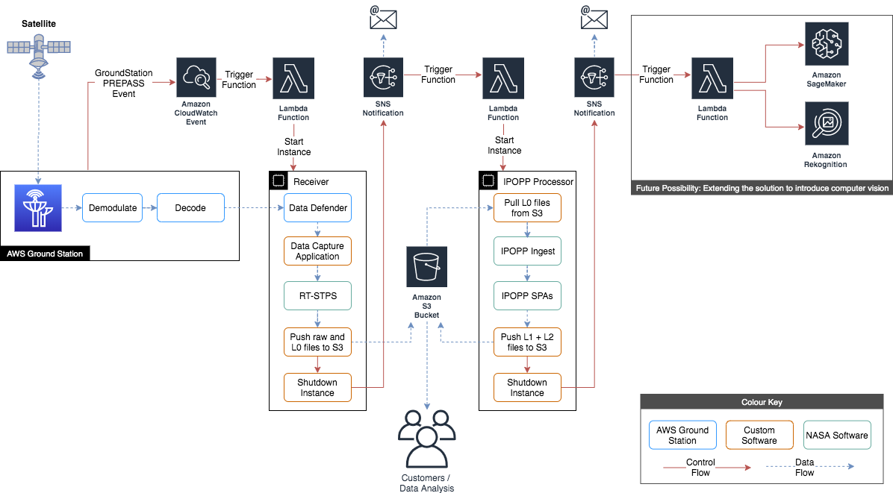

Copyright Amazon.com, Inc. or its affiliates. All Rights Reserved.
PDX-License-Identifier: MIT-0

#	Implementing an Automated Ground Station EOS pipeline

Following this guide results in the implementation of an automated solution that downloads and processes data received from a satellite via the AWS GroundStation service.

This is the advanced version of the [Earth observation using AWS Ground Station blog post](https://aws.amazon.com/blogs/publicsector/earth-observation-using-aws-ground-station/). You may want to go through that first before continuing with this guide. 

# Solution Overview



The solution operates as follows:

1. AWS GroundStation triggers a CloudWatch event during a PREPASS transtion, a few minutes before a satellite contact.
2. The CloudWatch event, triggers a Lambda function which starts up the Receiver EC2 instance.
3. The Receiver EC2 instance captures the raw data from the Ground Station service via RT Logic's Data Defender software.
4. The Data Capture Application running on the Receive instance, strips out and combines the payload data from the incoming VITA 49 data stream.
5. The Data Capture Application starts up RT-STPS which processes the raw data into Level 0 data
6. The Data Capture Application pushes the data to S3, sends an SNS notification, then shuts down.
7. The SNS Notification triggers a Lambda function which starts up the Processor EC2 instance.
8. The Processor EC2 Instance pulls the data from S3, then processes it using IPOPP.
9. The Processor EC2 Instance pushes the Level 1A, Level 1B and Level 2 data it produces to S3.
10. The Processor EC2 Instance sends an SNS notification, then shuts down.

To summarize, by scheduling a satellite contact in AWS GroundStation, steps 1-10 are automatically completed, which result in the data being made available via the S3 bucket.
If you subscribe to the SNS notifications, you will also receive emails with the output of the processing jobs.

# Earth Observation Science Data Levels

Earth Observation data products are most commonly described using levels 0-4 provided by NASA.
The levels are summarized below. For more information click [here](https://science.nasa.gov/earth-science/earth-science-data/data-processing-levels-for-eosdis-data-products).

- Level 0: Raw data from sensors with communications artifacts removed
- Level 1: Georeferenced and adjusted for known sources of error or interference
- Level 2: Specific data-rich products such as sea surface temperature data, or visible light data
- Level 3: Data mapped onto uniform space-time grid scales
- Level 4: Model output or results from deeper analysis of lower-level data, often using data from multiple measurements

#	Prerequisites
---

##  AWS CLI Configured

[Install the latest AWS CLI](https://docs.aws.amazon.com/cli/latest/userguide/cli-chap-getting-started.html) and [configure it](https://docs.aws.amazon.com/cli/latest/userguide/cli-configure-quickstart.html#cli-configure-quickstart-config) with an IAM User role with privileges to the AWS Account you want to use.
If in doubt, use admin for testing, but create a Least Privileged Access (LPA) IAM user/role for any other environments.

##  Ground Station setup in your AWS Account

Send an email to aws-groundstation@amazon.com with the following details:
- Satellite NORAD ID: 27424 (AQUA)
- You AWS Account Id
- AWS Regions you want use the Ground Station Service
- AWS Regions you want to downlink the data to, normally the same as above

##	A VPC with public subnets, plus an SSH key for accessing EC2 instance(s)

Make sure at minimum you have one SSH key and one VPC with an attached IGW and one public subnet. 
You can use the default VPC provided in the region. Follow [these instructions](https://docs.aws.amazon.com/AWSEC2/latest/UserGuide/ec2-key-pairs.html#having-ec2-create-your-key-pair) to create an EC2 SSH key in the region that you will be deploying your EC2 resources. 

##	Register on NASA DRL website

NASA DRL requires everyone to register who uses their RT-STPS and IPOPP software. Browse to [the NASA DRL website](https://directreadout.sci.gsfc.nasa.gov/loginDRL.cfm?cid=263&type=software) and register using your company email address. You will need to confirm the email address.

##  Create working directory

Execute these commands on your local machine command line. 

### Linux / Mac

```bash
export WORKING_DIR='/Users/User/Downloads/ipopp-test'
mkdir -p $WORKING_DIR
cd $WORKING_DIR
```

### Windows

```bash
set WORKING_DIR=\Users\User\Downloads\ipopp-test
mkdir %WORKING_DIR%
cd %WORKING_DIR%
```

## Clone this repo
Install Git by following [these instructions](https://github.com/git-guides/install-git).

```bash
git clone https://github.com/awslabs/aws-groundstation-eos-pipeline.git
```

Alternatively, you can download this GitHub repository by clicking Code -> Download ZIP at the top of this page. 

#	Receiver Instance - RT-STPS
---

Follow the steps below to configure AWS GroundStation to process data from the AQUA Satellite and create an EC2 instance to receive the data.
The EC2 instance receives the data, processes it using NASA's RealTime Satellite Telemetry Processing Software (RT-STPS) and uploads the data to S3.
Once the data is uploaded and SNS Notification is sent which triggers the IPOPP Processing node which creates the usable data products.

##	Create S3 bucket

Setup some variables, then create the new S3 bucket.
Create this in the region where your EC2 downlink resources will be. 

Edit the REGION and S3_BUCKET variables below, then execute the code.

Execute these commands on your local machine command line. 

### Linux / Mac

```bash
export REGION=your-aws-region
export S3_BUCKET=your-bucket-name

# Create the new S3 bucket if not already created
aws s3 mb s3://${S3_BUCKET} --region $REGION
```

### Windows

```bash
set REGION=your-aws-region
set S3_BUCKET=your-bucket-name

aws s3 mb s3://%S3_BUCKET% --region %REGION%
```

##	Download RT-STPS from NASA DRL website

**Optional:** If you already have access to these files on another S3 bucket there is no need to download them again.

Download the following RT-STPS files from [NASA DRL](https://directreadout.sci.gsfc.nasa.gov/?id=dspContent&cid=325&type=software) to $WORKING_DIR: (Or copy them from another friendly bucket - see below)
- RT-STPS_7.0.tar.gz


##	Upload RT-STPS to the new S3 bucket:

If you already have the files in another S3 bucket then replace '$WORKING_DIR' with 's3://YOUR-S3-BUCKET/software/RT-STPS/'. 
If your S3 bucket is in a different region you will need to add a --source-region tag at the end of the command. 

Execute these commands on your local machine command line. 

### Linux / Mac

```bash
aws s3 cp $WORKING_DIR/RT-STPS_7.0.tar.gz s3://${S3_BUCKET}/software/RT-STPS/RT-STPS_7.0.tar.gz --region $REGION 
```

### Windows

```bash
aws s3 cp %WORKING_DIR%\RT-STPS_7.0.tar.gz s3://%S3_BUCKET%/software/RT-STPS/RT-STPS_7.0.tar.gz --region %REGION% 
```

## Copy the data capture application to the new bucket

The data capture application files (receivedata.py, awsgs.py, start-data-capture.sh) are all found in this repository. 

Execute these commands on your local machine command line. 

### Linux / Mac

```bash
aws s3 cp $WORKING_DIR/aws-groundstation-eos-pipeline/python/receivedata.py s3://${S3_BUCKET}/software/data-receiver/receivedata.py --region $REGION 
aws s3 cp $WORKING_DIR/aws-groundstation-eos-pipeline/python/awsgs.py s3://${S3_BUCKET}/software/data-receiver/awsgs.py --region $REGION 
aws s3 cp $WORKING_DIR/aws-groundstation-eos-pipeline/bash/start-data-capture.sh s3://${S3_BUCKET}/software/data-receiver/start-data-capture.sh --region $REGION 
```

### Windows

```bash
aws s3 cp %WORKING_DIR%\aws-groundstation-eos-pipeline\python\receivedata.py s3://%S3_BUCKET%/software/data-receiver/receivedata.py --region %REGION% 
aws s3 cp %WORKING_DIR%\aws-groundstation-eos-pipeline\python\awsgs.py s3://%S3_BUCKET%/software/data-receiver/awsgs.py --region %REGION% 
aws s3 cp %WORKING_DIR%\aws-groundstation-eos-pipeline\bash\start-data-capture.sh s3://%S3_BUCKET%/software/data-receiver/start-data-capture.sh --region %REGION% 
```

## Create the CloudFormation Stack for the receiver instance

Create a CFN stack using the template: aqua-rt-stps.yml. [Learn how to create a CFN stack](https://docs.aws.amazon.com/AWSCloudFormation/latest/UserGuide/cfn-console-create-stack.html). On the [stack creation console](https://console.aws.amazon.com/cloudformation) click Create Stack -> With New Resource. Then select the "Template is ready" radio button and "Upload a template file" radio button. Upload the aqua-rt-stps.yml file here. Do not edit the aqua-rt-stps.yml file manually!

Here is the link to the .yml file:
https://github.com/awslabs/aws-groundstation-eos-pipeline/tree/main/cfn

Enter parameters as follows in the CloudFormation console:

**Important Note** The IP address or range you enter into the SSHCidrBlock parameter will have access to both SSH on port 22 and the web-based Data Defender software on port 80. Adding large address ranges such as 0.0.0.0/0 will allow any IP address to access the ports and should not be done.

- Stack name: 'any value' e.g. gs-receiver-aqua
- AmiComponents: DDX 2.6.2 only
- CreateReceiverInstance: true
- InstanceType: c5.4xlarge
- NotificationEmail: 'your-email-address'
- S3Bucket: 'your-s3-bucket'
- SSHCidrBlock: 'your-public-ip'/32
- SSHKeyName: 'your-ssh-key-name'
- SatelliteName: AQUA
- SubnetId: 'a public subnet'
- VpcId: 'the VPC containing the above public subnet'

##  Subscribe to the SNS topic

During the creation of the CloudFormation stack an SNS topic is created.
To receive email messages you must subscribe to the topic by clicking the link sent to the email address specified when creating the stack.

##  Watch the progress

Once the EC2 instance is created the required software is installed and configured.
You can watch this progress by connecting to the instance using [SSH for Linux/Mac users](https://docs.aws.amazon.com/AWSEC2/latest/UserGuide/AccessingInstancesLinux.html) or by using [PuTTY for Windows users](https://docs.aws.amazon.com/AWSEC2/latest/UserGuide/putty.html). The username is "ec2-user". Example command for Linux/Mac to be run on your local machine: 

```bash
ssh -i <path-to-ssh-key-file> ec2-user@<instance-public-ip>
```

After logging in to the EC2 instance you can run this command in the terminal session to check the user-data logfile: 

```bash
tail -F /var/log/user-data.log
```

**Note1:** In the latest version of this solution, the Receiver instance automatically shuts down once configuration is completed.

**Note2:** For this solution to work correctly, the EC2 instance must either be shutdown a few minutes before the contact, or you must manually start the data capture application. The easy option: Shutdown/Stop the EC2 instance :).

##  Summary

You now have the following created in your AWS Account:

- A DataDeliveryServiceRole which the Ground Station service will use to create required resources in your AWS account
- The Receiver EC2 instance
- An IAM Role and Instance Profile, attached to the EC2 instance with permission to connect to a specified S3 bucket
- An ENI, attached to the EC2 instance to receive data from the Ground Station Service
- A Ground Station Mission Profile configured for the AQUA Satellite
- A Ground Station Demodulation and Decode configuration for the AQUA Satellite, compatible with the downstream processing software RT-STPS
- An SNS Topic to notify data capture completion
- GroundStation CloudWatch events
- A Lambda function which auto starts the EC2 instance during a PREPASS with a configured contact

#	Processor Instance Creation - IPOPP
---

Follow these steps to create the IPOPP instance which takes the data produced by the receiver node (RT-STPS) to create usable level 2 earth observation data products.
Execute these commands on your local machine command line.

```bash
export REGION=your-aws-region
export S3_BUCKET=your-bucket-name
```

### Windows

```bash
set REGION=your-aws-region
set S3_BUCKET=your-bucket-name
```

##  Copy the IPOPP files to the new bucket
The IPOPP scripts (ipopp-ingest.sh, install-ipopp.sh) are found in this repository. 

Manually download IMAPP_3.1.1_SPA_1.4_PATCH_2.tar.gz from [here](https://directreadout.sci.gsfc.nasa.gov/?id=dspContent&cid=290&type=software) to $WORKING_DIR. 

Manually download DRL-IPOPP_4.0_PATCH_1.tar.gz from [here](https://directreadout.sci.gsfc.nasa.gov/?id=dspContent&cid=304&type=software) to $WORKING_DIR. 

Execute these commands on your local machine command line.

### Linux / Mac

```bash
aws s3 cp $WORKING_DIR/aws-groundstation-eos-pipeline/bash/ipopp-ingest.sh s3://${S3_BUCKET}/software/IPOPP/ipopp-ingest.sh --region $REGION 
aws s3 cp $WORKING_DIR/aws-groundstation-eos-pipeline/bash/install-ipopp.sh s3://${S3_BUCKET}/software/IPOPP/install-ipopp.sh --region $REGION 
aws s3 cp $WORKING_DIR/IMAPP_3.1.1_SPA_1.4_PATCH_2.tar.gz s3://${S3_BUCKET}/software/IMAPP/IMAPP_3.1.1_SPA_1.4_PATCH_2.tar.gz --region $REGION 
aws s3 cp $WORKING_DIR/DRL-IPOPP_4.0_PATCH_1.tar.gz s3://${S3_BUCKET}/software/IPOPP/DRL-IPOPP_4.0_PATCH_1.tar.gz --region $REGION
```

### Windows

```bash
aws s3 cp %WORKING_DIR%\aws-groundstation-eos-pipeline\bash\ipopp-ingest.sh s3://%S3_BUCKET%/software/IPOPP/ipopp-ingest.sh --region %REGION% 
aws s3 cp %WORKING_DIR%\aws-groundstation-eos-pipeline\bash\install-ipopp.sh s3://%S3_BUCKET%/software/IPOPP/install-ipopp.sh --region %REGION% 
aws s3 cp %WORKING_DIR%\IMAPP_3.1.1_SPA_1.4_PATCH_2.tar.gz s3://%S3_BUCKET%/software/IMAPP/IMAPP_3.1.1_SPA_1.4_PATCH_2.tar.gz --region %REGION% 
aws s3 cp %WORKING_DIR%\DRL-IPOPP_4.0_PATCH_1.tar.gz s3://%S3_BUCKET%/software/IPOPP/DRL-IPOPP_4.0_PATCH_1.tar.gz --region %REGION%
```

##  Create the IPOPP Instance CloudFormation Stack

**Note:** before continuing, subscribe to the *CentOS 7 (x86_64) - with Updates HVM* product in the Marketplace by clicking [here](https://aws.amazon.com/marketplace/server/configuration?productId=b7ee8a69-ee97-4a49-9e68-afaee216db2e&ref_=psb_cfg_continue) You just have to click the Accept Terms orange box. 

Create a CFN stack using the template: ipopp-instance.yml. Follow the same procedure as for the aqua-rt-stps.yml file. Do not edit the ipopp-instance.yml file manually!

Here is the link to the .yml file:
https://github.com/awslabs/aws-groundstation-eos-pipeline/tree/main/cfn

Enter parameters as follows:

**Important Note** The IP address or range you enter into the SSHCidrBlock parameter will have access to SSH on port 22. Adding large address ranges such as 0.0.0.0/0 will allow any IP address to access the port and should not be done.

- Stack name: 'any value' e.g. gs-processor-aqua
- AcceptNasaLicenseAgreement: Accept
- InstanceType: c5.xlarge is OK for most IPOPP Software Processing Algorithms (SPAs). However, you will need c5.4xlarge to use the Blue Marble MODIS Sharpened Natural/True color SPAs.
- IpoppPassword: 'Enter a password to use for the ipopp user account and VNC password on the EC2 instance'
- NotificationEmail: 'Your email where you want to receive all the notifications'
- ReceiverCloudFormationStackName: 'StackName for the receiver instance'
- S3Bucket: 'your-bucket-name' (The one you created earlier)
- SSHCidrBlock: 'your-public-ip'/32. If needed get it from https://whatismyip.com. Ensure you add “/32” to the end of the IP address
- SSHKeyName: 'your-ssh-key-name'
- SatelliteName: AQUA
- SubnetId: 'A Public Subnet'
- VpcId: 'Select the VPC containing the above public subnet'


##  Subscribe to the SNS topic

During the creation of the CloudFormation stack an SNS topic is created.
To receive email messages you must subscribe to the topic by clicking the link sent to the email address specified when creating the stack.

##  Watch the progress  

The initial part of the EC2 instance set up is automatic. After it has finished you will be prompted to manually complete the set up by following the steps in the next section Processor Instance Configuration - IPOPP. You can follow the progress of the automatic part over SSH by running the following commands. This takes about 10 minutes to complete. 

SSH Connection:
```bash
ssh -i <path-to-ssh-key-file> centos@<instance-public-ip>
```

Check the user-data logfile:
```bash
tail -F /var/log/user-data.log
```

##  Summary

You now have the following created in your AWS Account:

- An EC2 Instance running CentOS7
- An SNS topic to notify processing completion
- A Lambda function to auto-start the IPOPP instance, triggered by the receiver SNS Topic

#	Processor Instance Configuration - IPOPP
---

These last steps in the configuration of the IPOPP processor instance must be completed manually due to constraints in the distribution and operation of the NASA DRL IPOPP software.  


## Prerequisites

Download and install the Tiger VNC Client from [here](https://sourceforge.net/projects/tigervnc/files/stable/1.12.0/).
Or use the following quick-links for [Linux](https://sourceforge.net/projects/tigervnc/files/stable/1.12.0/tigervnc-1.12.0.x86_64.tar.gz/download),
[Mac](https://sourceforge.net/projects/tigervnc/files/stable/1.12.0/TigerVNC-1.12.0.dmg/download)
and [64 bit Windows](https://sourceforge.net/projects/tigervnc/files/stable/1.12.0/vncviewer64-1.12.0.exe/download).

## VNC Setup - Linux / Mac

1.	Run the command below to connect to the EC2 instance from your local machine using SSH and tunnel the VNC traffic over the SSH session.

    ```bash
    ssh -L 5901:localhost:5901 -i <path to pem file> centos@<public ip address of EC2 instance>
    ```

2.	Open the Tiger VNC Client application on your PC and connect to ‘localhost:1’
    (If you are seeing just a black screen, please refer to Note 2 below.)
3.	When prompted, enter the ipopp password you provided to the CloudFormation template in the earlier step


##	VNC Setup - Windows

1.	Download the open source ssh client Putty from [here](https://www.chiark.greenend.org.uk/~sgtatham/putty/latest.html)
2.	Open Putty and enter the public IP of the EC2 instance in the Session->Host Name (or IP Address) field.
3.	Enter 'centos' in Connection->Data-> Auto-login username
4.	In Connection->SSH->Auth, browse to the correct PPK key file (private SSH key) for the EC2 instance
5.	In Connection->SSH->Tunnels, enter 5901 in Source port, enter localhost:5901 in Destination, click Add
6.	Click Session, enter a friendly name in Save Sessions, then click Save
7.	Click Open to open the tunneled SSH session
8.	Open the Tiger VNC Client application on your PC and connect to ‘localhost:1’
9.	When prompted, enter the ipopp password you provided to the CloudFormation template in the earlier step

**Note1:** Typically EC2 instances within your AWS account use ".pem" SSH key format, but PuTTy requires ".ppk" format for the SSH key.
Please download and install PuTTygen [here](https://www.puttygen.com/), and convert the ".pem" SSH key into a ".ppk" SSH key.

**Note2:** If the Tiger VNC client cannot connect, or you see only a blank screen you may need to restart the vncserver process on the instance. To do this run the commands below in the SSH session to start the vnc server as the ipopp user:

```bash
su - ipopp
vncserver -kill <display> e.g. ‘:1’
vncserver
```


## Download and install DRL-IPOPP_4.0.tar.gz

**Optional** If you already have this archive saved locally or in an S3 bucket then upload it to ${S3_BUCKET}/software/IPOPP/DRL-IPOPP_4.0.tar.gz If you do not have access to the archive then follow these installation instructions.  

**Note:** NASA DRL requires you to use a system with the same IP address to download and run the DRL-IPOPP_4.0.tar.gz download script. If you restart your EC2 instance before completing the download and it acquires a new Public IP address then it will be necessary to download and run a fresh script. The script must also be run to completion within 24 hours after it was downloaded, or it will be necessary to download and run a fresh script.

Execute these commands as the centos user on the processor EC2 instance after logging in with SSH or PuTTY. 

1. Open Firefox and navigate to https://directreadout.sci.gsfc.nasa.gov/?id=dspContent&cid=304&type=software 
2. Login using your credentials. 
3. Click the blue box "Click To Download Version: 4.0" and accept the statement.
4. Download downloader_DRL-IPOPP_4.0.sh 
5. Open a terminal and navigate to the Downloads directory. 

    ```bash
    cd /home/ipopp/Downloads
    ```

6. Move the downloader_DRL-IPOPP_4.0.sh script to /home/ipopp/ 

    ```bash
    mv downloader_DRL-IPOPP_4.0.sh /home/ipopp/downloader_DRL-IPOPP_4.0.sh 
    ```

7. Make the download script executable and run it.

    ```bash
    cd /home/ipopp/
    chmod +x downloader_DRL-IPOPP_4.0.sh
    ./downloader_DRL-IPOPP_4.0.sh
    ```

8. Wait for the download to finish. This should take about 1 hour, so now is a good time to get some lunch. 
9. Once DRL-IPOPP_4.0.tar.gz is downloaded and assembled run the install-ipopp.sh script as root. Set the needed variables. 

    ```bash
    export SatelliteName=AQUA
    export S3Bucket=your-bucket-name 
    sudo /opt/aws/groundstation/bin/install-ipopp.sh ${SatelliteName} ${S3Bucket} 
    ```


##  IPOPP SPA Configuration

By default IPOPP creates data products which are Level 1A and Level 1B only.
These data products are great to use for further processing using software such as polar2grid, but if we want IPOPP to create usable Level 2 products we must enable additional IPOPP Software Processing Algorithms (SPAs).
Unfortunately, SPAs can only be configured using a GUI java application.
Follow the steps below to connect to the server using a VPC client, then configure the required SPAs.

Perform the following steps within the VNC session on the IPOPP EC2 instance.  

1. Open a terminal and run the ipopp dashboard:

    ```bash
    ~/drl/tools/dashboard.sh &
    ```

2.	In the dashboard, click Mode->Configuration Editor
3.	Click Actions->Configure Projection, Select Stereographic, then Click Configure Projection
4.	Enable other SPA modules as desired by simply clicking on them. You may want to enable all of SPAs in your initial experimentation to see the data created by each SPA.
5.	Once you have finished enabling SPAs, click Actions->Save IPOPP Configuration
6.	To start the SPA services and see the progress visually, click Mode->IPOPP Process Monitor, click 'Yes' to save, then click Actions->Start SPA Services, click 'Yes' to confirm. This will start-up the required services. Each service when started will check for the input data it requires and process it. The processed data for AQUA can be found here: $HOME/drl/data/pub/gsfcdata/aqua/modis/level2

Once this configuration process is done it does not need to be done again. IPOPP will now automatically start the additional SPAs each time an ingest is done.

##  Configure the IPOPP Instance to shutdown after processing

Now that IPOPP is configured, we can configure it to shutdown after processing the data.
We do this by adding a shutdown command after the processing command in the /etc/rc.local file

1. In an SSH or VNC session on the IPOPP server, open terminal.
2. Switch to root

    ```bash
    sudo su - 
    ```

3. Open the /etc/rc.local file

    ```bash
    nano /etc/rc.local
    ```

4. Locate the last line (It will have a call to 'ipopp-ingest.sh' in it) and add **' && systemctl poweroff -i'** to the end of the line, after the double quotes and without the single quotes. The line should look like the one below: 

    ```bash
    runuser -l ipopp -c "/opt/aws/groundstation/bin/ipopp-ingest.sh AQUA <bucket-name> | tee /opt/aws/groundstation/bin/ipopp-ingest.log 2>&1" && systemctl poweroff -i
    ```

5. You can now exit the VNC and SSH session.


# Stop the EC2 instances

The EC2 instances are automatically started and stopped as required. To allow this to happen you must now stop all EC2 instances.

# Scheduling a Satellite Contact

At this point you can schedule a contact with AQUA using the AWS console.

##  Scheduling a live AQUA contact

Open up the GroundStation console and schedule a contact as required. Ensure you select the correct mission profile and satellite.
The entire process will be triggered by the GroundStation PREPASS CloudWatch event as described in the Solution overview section.


# Viewing the files created

When you captured data from a live satellite both instances will automatically shut down when they are finished processing.
You will find an email in your inbox with a summary from each node.

You can find the created files in the S3 bucket as follows:

- Level 0,1,2 Data Products: s3://${S3_BUCKET}/data/AQUA/modis/
- Logfiles: s3://${S3_BUCKET}/data/AQUA/logs
- Raw data for re-processing: s3://${S3_BUCKET}/data/AQUA/raw

# Known Errors
---

1. To detect and copy created data products to the S3 bucket, ipopp-ingest.sh simply calls "aws s3 sync" in a loop. Sometimes this command detects a file and tries to copy it when it is still being written to by the IPOPP process. This causes the s3 sync command to return a non-zero return code.

2. Occasionally the vncserver process does not start correctly, or sometime provides blank screen when you connect. To workaround this issue just kill and restart the vncserver process:

    ```bash
    su - ipopp
    vncserver -kill <display> e.g. ‘:1’
    vncserver
    ```
    
3. This is more of an FYI than an error. IPOPP will limit the products it produces if it is dark during the satellite contact. So if you don't see the product you need this may be the reason. For deeper troubleshooting you will need to get low-down and dirty in IPOPP and SPA error tracking - this is a bit messy and probably warrants it's own separate document!
